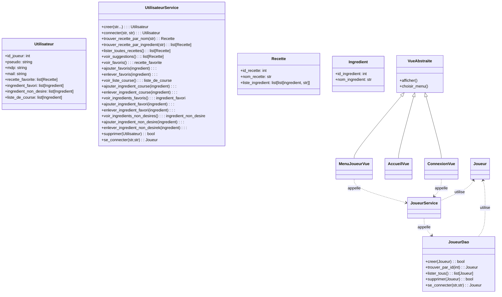

```mermaid
classDiagram
    class Utilisateur {
        +id_joueur: int
        +pseudo: string
        +mdp: string
        +mail: string
        +recette_favorite: list[Recette]
        +ingredient_favori: list[Ingredient]
        +ingredient_non_desire: list[Ingredient]
        +liste_de_course: list[Ingredient]
    }
    
    class JoueurDao {
        +creer(Joueur): bool
        +trouver_par_id(int): Joueur
        +lister_tous(): list[Joueur]
        +supprimer(Joueur): bool
        +se_connecter(str,str): Joueur
    }
    
    class UtilisateurService {
        +creer(str...) : : Utilisateur
        +connecter(str, str) : : Utilisateur
        +trouver_recette_par_nom(str): Recette
        +trouver_recette_par_ingredient(str): list[Recette]
        +lister_toutes_recettes(): list[Recette]
        +voir_suggestions() :: list[Recette]

        +voir_favoris() : : recette_favorite
        +ajouter_favoris(ingredient) : : 
        +enlever_favoris(ingredient) : :

        +voir_liste_course() : : liste_de_course
        +ajouter_ingredient_course(ingredient) : : 
        +enlever_ingredient_course(ingredient) : :

        +voir_ingredients_favoris() : : ingredient_favori
        +ajouter_ingredient_favori(ingredient) : : 
        +enlever_ingredient_favori(ingredient) : :

        +voir_ingredients_non_desires() : : ingredient_non_desire
        +ajouter_ingredient_non_desire(ingredient) : : 
        +enlever_ingredient_non_desirek(ingredient) : : 

        +supprimer(Utilisateur): bool
        +se_connecter(str,str): Joueur
    }

    class Recette {
        +id_recette: int
        +nom_recette: str
        +liste_ingredient: list[list[ingredient, str]]
    }
    
    class Ingredient {
        +id_ingredient: int
        +nom_ingredient: str
    }

    class MenuJoueurVue {
    }

    class VueAbstraite{
      +afficher()
      +choisir_menu()
    }

    VueAbstraite <|-- AccueilVue
    VueAbstraite <|-- ConnexionVue
    VueAbstraite <|-- MenuJoueurVue
    MenuJoueurVue ..> JoueurService : appelle
    ConnexionVue ..> JoueurService : appelle
    JoueurService ..> JoueurDao : appelle
    Joueur <.. JoueurService: utilise
    Joueur <.. JoueurDao: utilise
```