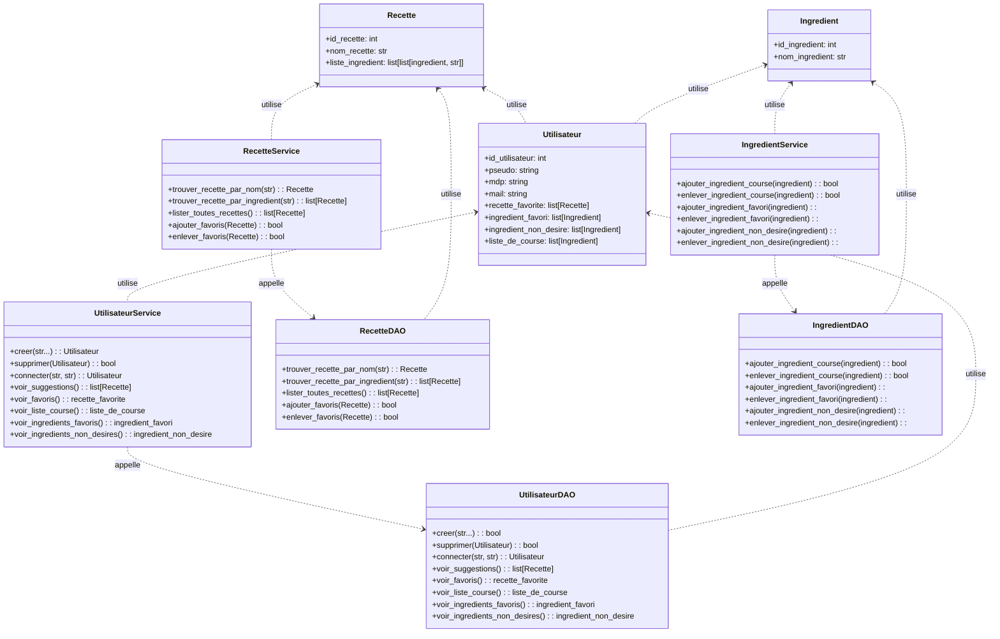

```mermaid
classDiagram
    class Utilisateur {
        +id_utilisateur: int
        +pseudo: string
        +mdp: string
        +mail: string
        +recette_favorite: list[Recette]
        +ingredient_favori: list[Ingredient]
        +ingredient_non_desire: list[Ingredient]
        +liste_de_course: list[Ingredient]
    }

    class UtilisateurDAO {
        +creer(str...): bool
        +supprimer(Utilisateur): bool
        +connecter(str, str): Utilisateur

        +voir_suggestions(): list[Recette]

        +voir_favoris(): recette_favorite

        +voir_liste_course(): liste_de_course

        +voir_ingredients_favoris(): ingredient_favori

        +voir_ingredients_non_desires(): ingredient_non_desire
    }

    class UtilisateurService {
        +creer(str...): Utilisateur
        +supprimer(Utilisateur): bool
        +connecter(str, str): Utilisateur

        +voir_suggestions(): list[Recette]

        +voir_favoris(): recette_favorite

        +voir_liste_course(): liste_de_course

        +voir_ingredients_favoris(): ingredient_favori

        +voir_ingredients_non_desires(): ingredient_non_desire
    }


    class Recette {
        +id_recette: int
        +nom_recette: str
        +liste_ingredient: list[list[ingredient, str]]
    }

    class RecetteService {
        +trouver_recette_par_nom(str): Recette
        +trouver_recette_par_ingredient(str): list[Recette]
        +lister_toutes_recettes(): list[Recette]

        +ajouter_favoris(Recette): bool
        +enlever_favoris(Recette): bool
    }

    class RecetteDAO {
        +trouver_recette_par_nom(str): Recette
        +trouver_recette_par_ingredient(str): list[Recette]
        +lister_toutes_recettes(): list[Recette]

        +ajouter_favoris(Recette): bool
        +enlever_favoris(Recette): bool
    }


    class Ingredient {
        +id_ingredient: int
        +nom_ingredient: str
    }

    class IngredientService {
        +ajouter_ingredient_course(ingredient): bool
        +enlever_ingredient_course(ingredient): bool

        +ajouter_ingredient_favori(ingredient):
        +enlever_ingredient_favori(ingredient):

        +ajouter_ingredient_non_desire(ingredient):
        +enlever_ingredient_non_desire(ingredient):
    }

    class IngredientDAO {
        +ajouter_ingredient_course(ingredient): bool
        +enlever_ingredient_course(ingredient): bool

        +ajouter_ingredient_favori(ingredient):
        +enlever_ingredient_favori(ingredient):

        +ajouter_ingredient_non_desire(ingredient):
        +enlever_ingredient_non_desire(ingredient):
    }


    UtilisateurService ..> UtilisateurDAO : appelle
    Utilisateur <.. UtilisateurService: utilise
    Utilisateur <.. UtilisateurDAO: utilise

    RecetteService ..> RecetteDAO : appelle
    Recette <.. RecetteService: utilise
    Recette <.. RecetteDAO: utilise

    IngredientService ..> IngredientDAO : appelle
    Ingredient <.. IngredientService: utilise
    Ingredient <.. IngredientDAO: utilise

    Recette <.. Utilisateur: utilise
    Ingredient <.. Utilisateur: utilise
```
