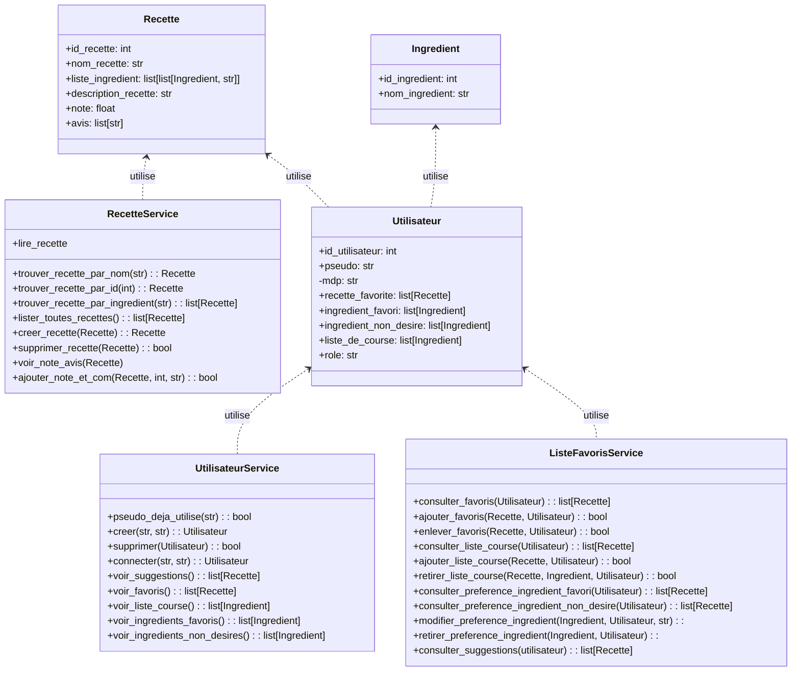

```mermaid
classDiagram
    class Utilisateur {
        +id_utilisateur: int
        +pseudo: str
        -mdp: str
        +recette_favorite: list[Recette]
        +ingredient_favori: list[Ingredient]
        +ingredient_non_desire: list[Ingredient]
        +liste_de_course: list[Ingredient]
        +role: str
    }

    class UtilisateurService {
        +pseudo_deja_utilise(str): bool
        +creer(str, str): Utilisateur
        +supprimer(Utilisateur): bool
        +connecter(str, str): Utilisateur

        +voir_suggestions(): list[Recette]

        +voir_favoris(): list[Recette]

        +voir_liste_course(): list[Ingredient]

        +voir_ingredients_favoris(): list[Ingredient]

        +voir_ingredients_non_desires(): list[Ingredient]
    }


    class ListeFavorisService {
        +consulter_favoris(Utilisateur): list[Recette]
        +ajouter_favoris(Recette, Utilisateur): bool
        +enlever_favoris(Recette, Utilisateur): bool

        +consulter_liste_course(Utilisateur): list[Recette]
        +ajouter_liste_course(Recette, Utilisateur): bool
        +retirer_liste_course(Recette, Ingredient, Utilisateur): bool

        +consulter_preference_ingredient_favori(Utilisateur): list[Recette]
        +consulter_preference_ingredient_non_desire(Utilisateur): list[Recette]
        +modifier_preference_ingredient(Ingredient, Utilisateur, str):
        +retirer_preference_ingredient(Ingredient, Utilisateur):

        +consulter_suggestions(utilisateur): list[Recette]
    }


    class Recette {
        +id_recette: int
        +nom_recette: str
        +liste_ingredient: list[list[Ingredient, str]]
        +description_recette: str
        +note: float
        +avis: list[str]
    }

    class RecetteService {
        +trouver_recette_par_nom(str): Recette
        +trouver_recette_par_id(int): Recette
        +trouver_recette_par_ingredient(str): list[Recette]
        +lister_toutes_recettes(): list[Recette]
        +creer_recette(Recette): Recette
        +supprimer_recette(Recette): bool
        +voir_note_avis(Recette)
        +ajouter_note_et_com(Recette, int, str): bool
        +lire_recette
    }


    class Ingredient {
        +id_ingredient: int
        +nom_ingredient: str
    }


    Utilisateur <.. UtilisateurService: utilise
    Utilisateur <.. ListeFavorisService: utilise

    Recette <.. RecetteService: utilise


    Recette <.. Utilisateur: utilise
    Ingredient <.. Utilisateur: utilise
```
